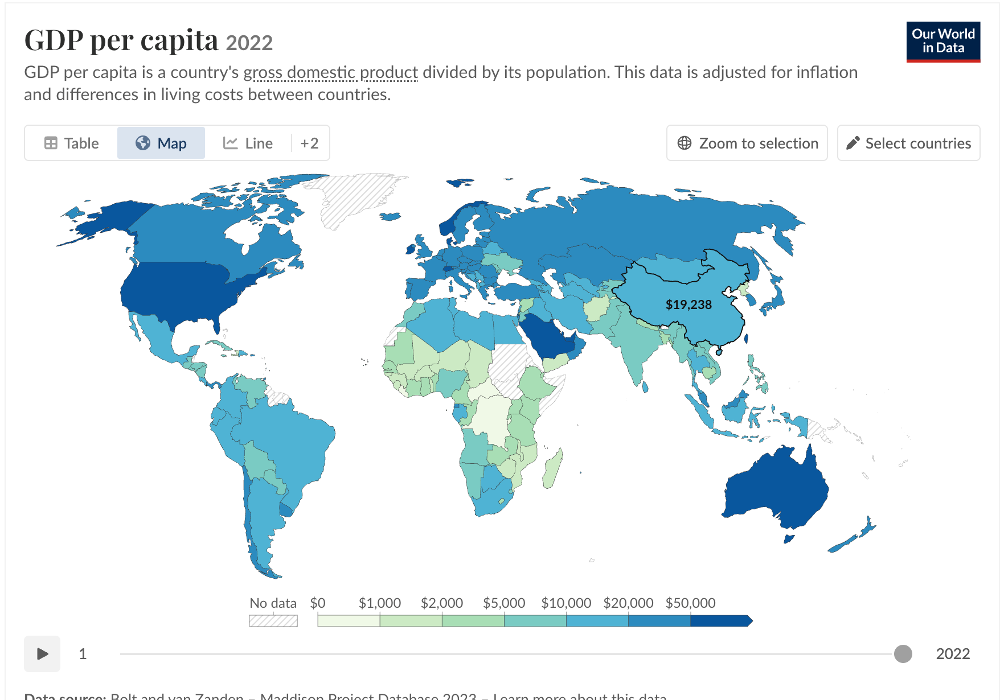
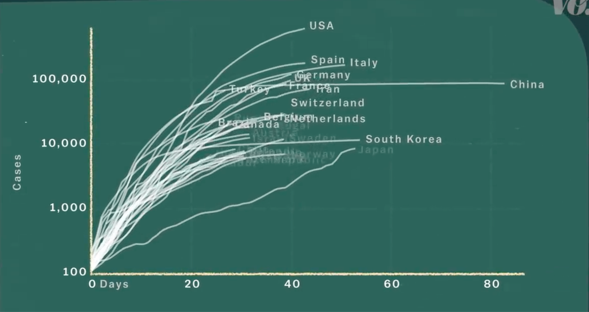
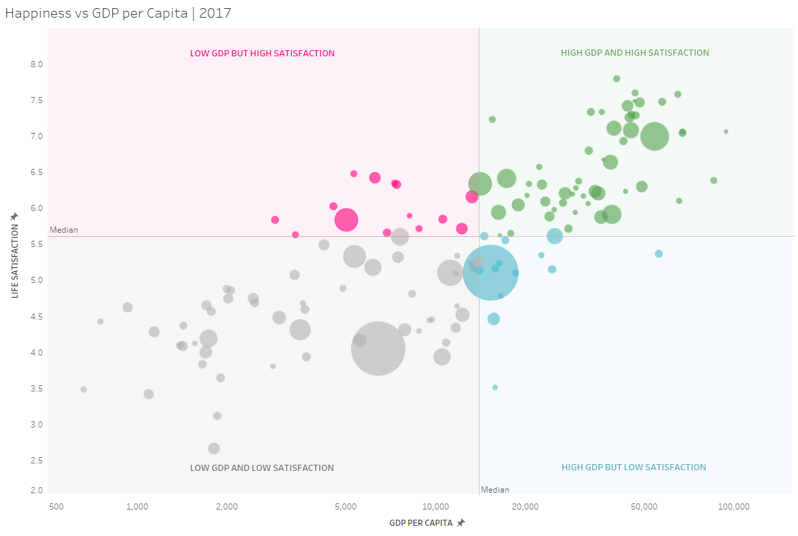
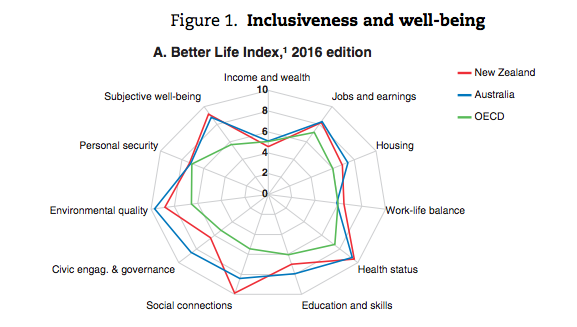
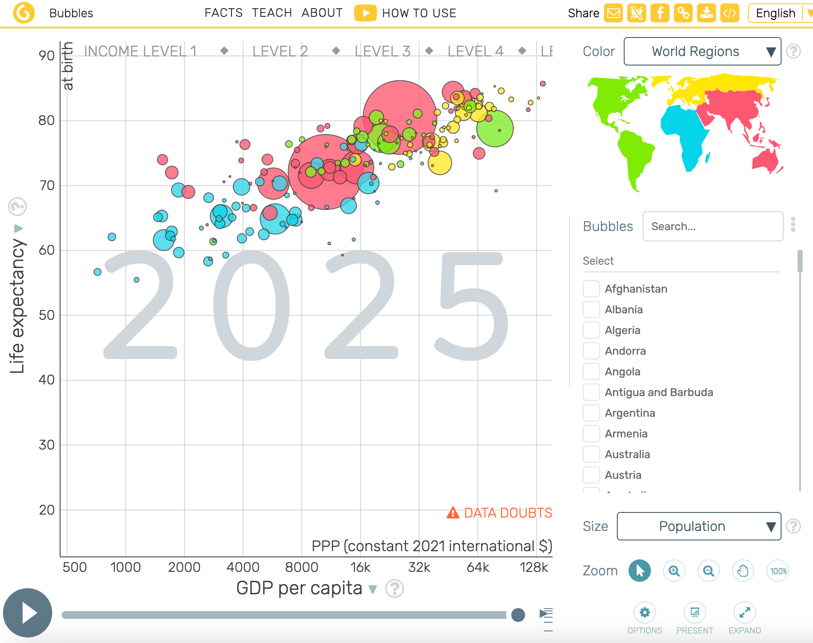

# Economic Growth and Human Well-being: Visualizing Paths of Progress Across Countries

## STATS 401 Final Project Proposal

**Luyu Su & Yifan Zuo**

---

## 1. Topic, Goals, and Questions

Economic growth is commonly used as an indicator of national progress, with GDP and GDP per capita serving as widely used measures of economic prosperity. However, economic prosperity does not necessarily translate into better health, education, employment conditions, or environmental quality. Our project investigates the relationship between economic growth and multidimensional human well-being across countries over time.

Our main visualization goal is to move beyond viewing GDP as a single measure of development and instead examine whether economic growth corresponds to improvements across multiple dimensions of human well-being.

The intended audience includes students, researchers, and general audiences interested in international development and global inequality. The visualization will help users compare countries, identify temporal patterns, investigate deviations from the GDP–well-being relationship, and explore different dimensions of national well-being.

Our main research questions are:

1. **How does economic prosperity vary across countries and over time?**
2. **How have countries followed different paths of economic and human development?**
3. **To what extent is higher GDP associated with higher human well-being?**
4. **Which dimensions contribute to differences in overall well-being across countries?**
5. **Which countries have successfully transitioned toward higher levels of both prosperity and well-being?**

---

## 2. Datasets

We plan to integrate internationally comparable socioeconomic, health, education, employment, and environmental data primarily from the World Bank Open Data and, where necessary, complementary sources such as Our World in Data and the United Nations.

Potential indicators include GDP per capita, life expectancy, educational attainment or an education-related index, employment indicators, and CO₂ emissions per capita. We will prioritize indicators with broad country coverage and consistent annual observations, approximately covering 2010–2024 where possible.

- [World Bank Open Data](https://data.worldbank.org/)
- [Our World in Data](https://ourworldindata.org/)
- [United Nations Data](https://data.un.org/)

Data will be acquired through downloadable datasets and APIs where available. We will clean and integrate the datasets by harmonizing country identifiers and years, removing missing observations, standardizing units, and selecting a common time range.

Numerical indicators will be normalized to comparable scales before constructing the composite Human Well-being Score. Environmental indicators with negative interpretations, such as CO₂ emissions per capita, will be transformed so that higher standardized values consistently represent better well-being.

The integrated dataset is expected to contain thousands of country-year observations, with approximately five to eight core indicators and additional metadata such as country, region, and year.

---

## 3. Analysis and Visualization Methods

The project will be implemented primarily using JavaScript and D3.js, together with HTML and CSS. Python may be used for data cleaning, preprocessing, statistical analysis, and generation of the final processed datasets.

The five visualizations will form a progressive analytical story:

### 1. Global Prosperity Overview – Choropleth Map

Shows GDP per capita across countries over time. Supports comparison, filtering, country selection, and details-on-demand.

### 2. Paths of Progress – Trajectory Visualization

Shows how countries change in economic and well-being dimensions over time. Supports trend identification and temporal comparison.

### 3. Prosperity vs. Well-being – Multidimensional Scatterplot

Examines the relationship between GDP per capita and the Human Well-being Score. Supports relationship discovery, comparison, and outlier detection.

### 4. Human Well-being Profile – Radar Chart

Breaks down well-being into multiple dimensions and allows users to explore different weights. Supports multidimensional comparison and exploration.

### 5. Development and Well-being Clusters – Map

Displays country clusters based on economic, health, education, employment, and environmental indicators. Supports geographic exploration, cluster comparison, and transition identification.

Together, the visualizations progress from **global overview → temporal exploration → relationship discovery → multidimensional analysis → development patterns**.

---

## 4. Visualization Sketches or References

Initial sketches will be developed as low-fidelity mockups before implementation.

| Visualization | Technique | Purpose |
|---|---|---|
| **Global Prosperity Overview** | Interactive choropleth map + time slider | Shows where economic prosperity is concentrated and how it changes globally over time. |
| **Paths of Progress** | Animated trajectory/trail visualization | Reveals how countries follow different economic and well-being development paths. |
| **Prosperity vs. Well-being** | Quadrant scatterplot | Tests whether greater economic prosperity corresponds to higher human well-being and identifies exceptions. |
| **Human Well-being Profile** | Radar chart + interactive weight controls | Shows the multidimensional composition of well-being and allows users to explore different proportions of aspects of well-being. |
| **Development and Well-being Clusters** | Clustered world map + temporal trajectories | Identifies groups of countries with similar development profiles and tracks movement between development states. |

### Visualization Sketches

#### Global Prosperity Overview

#### Paths of Progress

#### Prosperity vs. Well-being

#### Human Well-being Profile

#### Development and Well-being Clusters

---

## 5. Group Roles and Responsibilities

| Team Member | Primary Responsibilities |
|---|---|
| **Yifan Zuo** | Data acquisition, cleaning, integration, and processing; conduct quantitative analysis and construct derived indicators such as the Human Well-being Score; design and implement selected visualizations using D3.js; contribute to interaction design, testing, and refinement; contribute to documentation and presentation preparation. |
| **Luyu Su** | Data cleaning, processing, and preparation of datasets for visualization; conduct exploratory analysis and help interpret patterns and results; design and implement selected visualizations using D3.js; develop interactive features and the project website interface; contribute to testing, documentation, and presentation preparation. |

### Joint Responsibilities

Both members will contribute to refining the research questions, validating data and results, developing the overall visualization narrative, interpreting findings, conducting user testing and debugging, and preparing the final report, poster, and presentation. Both members will understand and contribute to the overall project.

---

## 6. Interim Presentation Deliverables

By the Interim Presentation, we expect to have completed the initial integrated dataset, documented the major cleaning and preprocessing steps, and conducted exploratory analysis of the selected indicators.

We plan to demonstrate an initial D3.js prototype, particularly the interactive world map and one preliminary analytical visualization, together with early findings about the GDP–well-being relationship.

---

## 7. Timeline and Milestones

| Week | Milestone | Key Tasks | Responsible Members | Expected Output |
|---|---|---|---|---|
| **Week 2** | **Project Definition** | Finalize research questions, indicators, visualization concepts, and initial sketches. | Both Members | Project scope and visualization plan |
| **Week 3** | **Data Preparation** | Acquire, clean, and integrate data; prepare datasets for analysis and visualization. | Both | Integrated dataset |
| **Week 4** | **Analysis & Design** | Conduct EDA and develop the well-being score; refine visualization and interaction designs. | Both | Preliminary analysis and designs |
| **Week 5** | **Interim Prototype** | Implement initial D3.js visualizations and basic interactions. | Both | Working D3.js prototype |
| **Week 6** | **Implementation & Refinement** | Complete visualizations and interactions; integrate data and refine the system. | Both | Complete visualization system |
| **Week 7** | **Final Integration** | Test, debug, validate results, and finalize the website, report, poster, and presentation. | Both | Final project package |